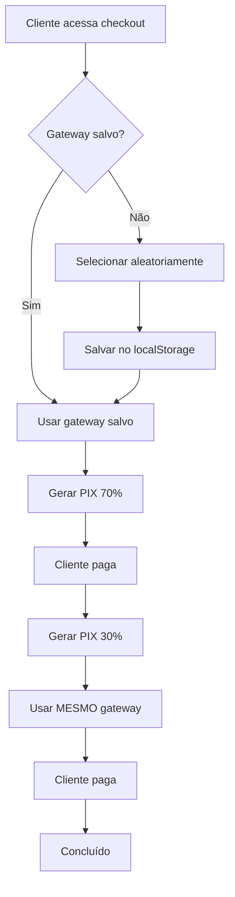

# Sistema de Gerenciamento de Gateways

## Visão Geral

Sistema inteligente de seleção e gerenciamento de múltiplos gateways de pagamento com distribuição aleatória de carga e persistência por cliente.

## Objetivo

Distribuir os pagamentos entre diferentes gateways para:
- ✅ Evitar sobrecarga em um único gateway
- ✅ Reduzir perdas por falhas de gateway
- ✅ Aumentar taxa de conversão
- ✅ Ter redundância automática

## Como Funciona

### 1. Seleção Aleatória
Quando um cliente acessa o checkout pela primeira vez:
1. Sistema seleciona aleatoriamente um gateway entre os habilitados
2. Salva a escolha no `localStorage` com a chave `selected-gateway`
3. Todas as transações desse cliente usarão o mesmo gateway

### 2. Persistência
- O gateway selecionado fica salvo no navegador do cliente
- Mesmo que o cliente feche e abra o site, usará o mesmo gateway
- Garante consistência: primeiro PIX (70%) e segundo PIX (30%) usam o mesmo gateway

### 3. Distribuição
- Se houver 2 gateways habilitados: ~50% dos clientes em cada
- Se houver 3 gateways habilitados: ~33% dos clientes em cada
- Se houver 4 gateways habilitados: ~25% dos clientes em cada

## Configuração

### Arquivo: `lib/gateway-manager.ts`

```typescript
const GATEWAYS: GatewayConfig[] = [
  {
    id: 'ezzpag',
    name: 'Ezzpag',
    enabled: true,  // ← Alterar para true/false
    endpoint: '/api/payment-transaction',
    checkEndpoint: '/api/check-payment-status',
    priority: 1
  },
  {
    id: 'ghost',
    name: 'Ghost Pay',
    enabled: true,  // ← Alterar para true/false
    endpoint: '/api/ghost-transaction',
    checkEndpoint: '/api/check-ghost-payment',
    priority: 1
  },
  // ... outros gateways
]
```

### Habilitar/Desabilitar Gateways

Para habilitar um gateway:
```typescript
enabled: true
```

Para desabilitar um gateway:
```typescript
enabled: false
```

### Sistema de Prioridade (Opcional)

Você pode dar peso diferente para cada gateway:

```typescript
{
  id: 'ezzpag',
  enabled: true,
  priority: 2  // ← Receberá 2x mais clientes
}
```

Exemplo com 3 gateways:
- Gateway A: `priority: 2` → 50% dos clientes
- Gateway B: `priority: 1` → 25% dos clientes
- Gateway C: `priority: 1` → 25% dos clientes

## Gateways Disponíveis

### 1. Ezzpag
- **ID**: `ezzpag`
- **Status**: ✅ Implementado e testado
- **Endpoint**: `/api/payment-transaction`
- **Check**: `/api/check-payment-status`

### 2. Ghost Pay
- **ID**: `ghost`
- **Status**: ✅ Implementado (novo)
- **Endpoint**: `/api/ghost-transaction`
- **Check**: `/api/check-ghost-payment`
- **Requer**: `GHOST_SECRET_KEY` e `GHOST_COMPANY_ID` no `.env`

### 3. BlackCat
- **ID**: `blackcat`
- **Status**: ✅ Implementado
- **Endpoint**: `/api/blackcat-transaction`
- **Check**: `/api/check-blackcat-payment`
- **Requer**: `BLACKCAT_API_AUTH` no `.env`

### 4. Ativo/Umbrela
- **ID**: `ativo`
- **Status**: ✅ Implementado
- **Endpoint**: `/api/ativo-transaction`
- **Check**: `/api/check-ativo-payment`
- **Requer**: API Key configurada no código

## Funções Disponíveis

### `getClientGateway()`
Obtém o gateway para o cliente atual. Se não houver um salvo, seleciona aleatoriamente.

```typescript
import { getClientGateway } from '@/lib/gateway-manager'

const gateway = getClientGateway()
console.log(gateway.name) // "Ezzpag"
console.log(gateway.endpoint) // "/api/payment-transaction"
```

### `getCurrentGatewayInfo()`
Retorna informações do gateway atual sem selecionar um novo.

```typescript
import { getCurrentGatewayInfo } from '@/lib/gateway-manager'

const info = getCurrentGatewayInfo()
if (info) {
  console.log(`Cliente está usando: ${info.name}`)
}
```

### `resetGatewaySelection()`
Força a seleção de um novo gateway (útil para retry em caso de erro).

```typescript
import { resetGatewaySelection } from '@/lib/gateway-manager'

// Em caso de erro crítico, tentar outro gateway
try {
  // ... tentativa de pagamento
} catch (error) {
  const newGateway = resetGatewaySelection()
  console.log(`Tentando com novo gateway: ${newGateway.name}`)
}
```

### `setGateway(gatewayId)`
Define manualmente qual gateway usar (útil para admin/debug).

```typescript
import { setGateway } from '@/lib/gateway-manager'

// Forçar uso do Ghost Pay
setGateway('ghost')
```

### `trackGatewayUsage(gatewayId)`
Rastreia uso do gateway (para analytics).

```typescript
import { trackGatewayUsage } from '@/lib/gateway-manager'

trackGatewayUsage('ezzpag')
```

### `getGatewayStats()`
Obtém estatísticas de uso dos gateways.

```typescript
import { getGatewayStats } from '@/lib/gateway-manager'

const stats = getGatewayStats()
console.log(stats)
// { ezzpag: 45, ghost: 38, blackcat: 12, ativo: 5 }
```

## Integração no Checkout

O sistema já está integrado em:

### 1. Geração de PIX (70% ou 100%)
```typescript
// app/checkout/page.tsx - linha ~891
const gateway = getClientGateway()
const response = await fetch(gateway.endpoint, { ... })
```

### 2. Geração de PIX de Impostos (30%)
```typescript
// app/checkout/page.tsx - linha ~1001
const gateway = getClientGateway()
const response = await fetch(gateway.endpoint, { ... })
```

### 3. Polling de Pagamento
```typescript
// app/checkout/page.tsx - linha ~1180
const gateway = getClientGateway()
const response = await fetch(gateway.checkEndpoint, { ... })
```

## Indicador Visual (Debug)

Componente `GatewayIndicator` mostra qual gateway está sendo usado:

```tsx
import GatewayIndicator from '@/components/GatewayIndicator'

// Adicionar no layout ou página
<GatewayIndicator />
```

**Quando aparece:**
- ✅ Sempre em `localhost`
- ✅ Em produção com `?debug=1` na URL

## Fluxo Completo



## Cenários de Uso

### Cenário 1: Apenas Ezzpag Habilitado
```typescript
// lib/gateway-manager.ts
{ id: 'ezzpag', enabled: true }
{ id: 'ghost', enabled: false }
{ id: 'blackcat', enabled: false }
{ id: 'ativo', enabled: false }
```
**Resultado**: 100% dos clientes usam Ezzpag

### Cenário 2: Ezzpag + Ghost Pay
```typescript
{ id: 'ezzpag', enabled: true }
{ id: 'ghost', enabled: true }
{ id: 'blackcat', enabled: false }
{ id: 'ativo', enabled: false }
```
**Resultado**: ~50% Ezzpag, ~50% Ghost Pay

### Cenário 3: Todos Habilitados
```typescript
{ id: 'ezzpag', enabled: true }
{ id: 'ghost', enabled: true }
{ id: 'blackcat', enabled: true }
{ id: 'ativo', enabled: true }
```
**Resultado**: ~25% cada gateway

### Cenário 4: Com Prioridade
```typescript
{ id: 'ezzpag', enabled: true, priority: 3 }
{ id: 'ghost', enabled: true, priority: 2 }
{ id: 'blackcat', enabled: true, priority: 1 }
```
**Resultado**: 50% Ezzpag, 33% Ghost, 17% BlackCat

## Monitoramento

### Ver Gateway Atual (Console)
```javascript
// No console do navegador
localStorage.getItem('selected-gateway')
// Retorna: "ezzpag", "ghost", etc.
```

### Ver Estatísticas
```javascript
// No console do navegador
JSON.parse(localStorage.getItem('gateway-stats'))
// Retorna: { ezzpag: 10, ghost: 8, ... }
```

### Forçar Novo Gateway
```javascript
// No console do navegador
localStorage.removeItem('selected-gateway')
// Próxima compra selecionará novo gateway
```

## Vantagens

1. **Distribuição Automática**: Sem necessidade de configuração manual
2. **Persistência**: Cliente sempre usa o mesmo gateway
3. **Redundância**: Se um gateway cair, outros continuam funcionando
4. **Flexibilidade**: Fácil habilitar/desabilitar gateways
5. **Analytics**: Rastreamento de uso por gateway
6. **Transparência**: Indicador visual em debug mode

## Manutenção

### Adicionar Novo Gateway

1. Implementar as rotas:
   - `/api/novo-gateway-transaction/route.ts`
   - `/api/check-novo-gateway-payment/route.ts`
   - `/api/webhook/novo-gateway/route.ts`

2. Adicionar em `lib/gateway-manager.ts`:
```typescript
{
  id: 'novo-gateway',
  name: 'Novo Gateway',
  enabled: false,
  endpoint: '/api/novo-gateway-transaction',
  checkEndpoint: '/api/check-novo-gateway-payment',
  priority: 1
}
```

3. Habilitar quando estiver pronto:
```typescript
enabled: true
```

## Troubleshooting

### Cliente sempre usa o mesmo gateway
✅ **Normal!** É o comportamento esperado. Para testar outro gateway:
```javascript
localStorage.removeItem('selected-gateway')
```

### Gateway não está sendo usado
1. Verificar se está `enabled: true`
2. Verificar se as credenciais estão no `.env`
3. Verificar logs no console

### Erro "Nenhum gateway habilitado"
Pelo menos um gateway precisa estar `enabled: true`

## Segurança

- ✅ Seleção acontece no cliente (não expõe lógica de negócio)
- ✅ Credenciais ficam no servidor (variáveis de ambiente)
- ✅ Cliente não pode escolher gateway manualmente (exceto em debug)
- ✅ Validação server-side em todas as APIs

## Performance

- ⚡ Seleção é instantânea (localStorage)
- ⚡ Sem requisições extras ao servidor
- ⚡ Não impacta tempo de checkout
- ⚡ Distribuição é balanceada automaticamente

## Próximos Passos

1. ✅ Sistema implementado
2. ⏳ Habilitar Ghost Pay em produção
3. ⏳ Monitorar taxa de conversão por gateway
4. ⏳ Ajustar prioridades baseado em performance
5. ⏳ Implementar retry automático em caso de falha
